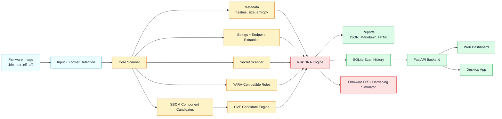
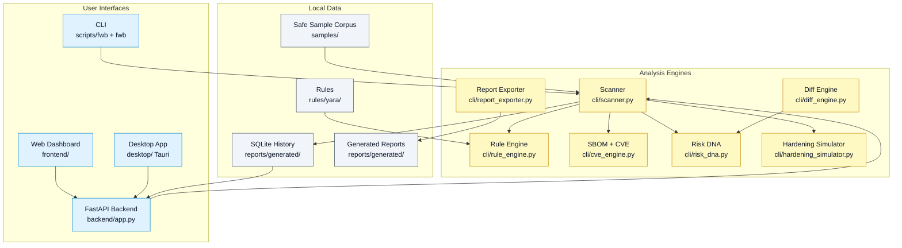
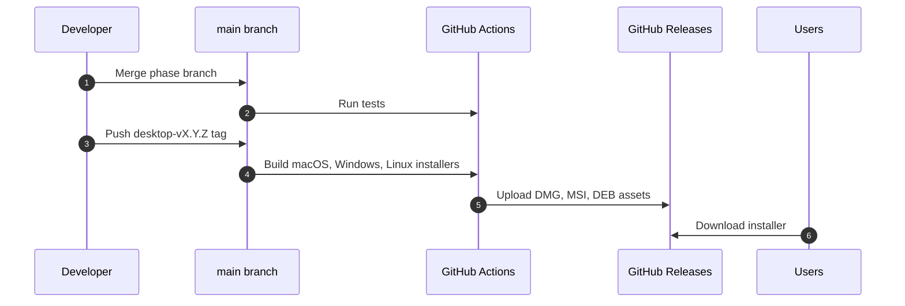

# Firmware Security Workbench

<p align="center">
  
</p>

<h3 align="center">A defensive firmware analysis workbench for embedded developers, Linux engineers, and security researchers.</h3>

<p align="center">
  <a href="https://github.com/YukiCodepth/firmware-security-workbench/actions/workflows/ci.yml"></a>
  <a href="https://github.com/YukiCodepth/firmware-security-workbench/actions/workflows/desktop-packages.yml"></a>
  <a href="https://pypi.org/project/firmware-security-workbench/"></a>
  <a href="https://github.com/YukiCodepth/firmware-security-workbench/releases/tag/desktop-v0.5.0"></a>
  
</p>

Firmware Security Workbench helps you inspect firmware images, surface risky evidence, compare versions, generate reports, and explain results through a local dashboard and desktop app. It is built for defensive research, secure firmware review, portfolio-grade learning, and open-source collaboration.

> Mermaid diagrams in this README render directly on GitHub. For zoom, pan, export, or editing, copy any Mermaid block into [Mermaid Live](https://mermaid.live).

## What It Does

| Area | Capability |
| --- | --- |
| Firmware intake | Scan `.bin`, `.hex`, `.elf`, `.uf2`, and raw firmware-like files |
| Metadata | File size, hashes, entropy, format guess, extracted strings |
| Detection | Suspicious strings, secrets, endpoints, debug leftovers, OTA clues |
| Rules | YARA-compatible local rules engine with match metadata |
| SBOM | CycloneDX-style component candidates from firmware evidence |
| CVE intelligence | Local CVE candidate matching with review notes and confidence |
| Risk DNA | Firmware fingerprint, score, band, tags, and risk trend |
| Diffing | Compare firmware versions and explain added/removed risk |
| Hardening | What-if simulator for projected risk reduction |
| Interfaces | CLI, FastAPI, web dashboard, and desktop app shell |
| Reports | JSON, Markdown, and HTML exports |
| Packaging | PyPI package, Docker image, and desktop installers for macOS, Windows, Linux |

## Download The App

Desktop installers are published as GitHub Release assets:

| Platform | Installer |
| --- | --- |
| macOS Apple Silicon | [Firmware Security Workbench_0.5.0_aarch64.dmg](https://github.com/YukiCodepth/firmware-security-workbench/releases/download/desktop-v0.5.0/Firmware.Security.Workbench_0.5.0_aarch64.dmg) |
| Windows x64 | [Firmware Security Workbench_0.5.0_x64_en-US.msi](https://github.com/YukiCodepth/firmware-security-workbench/releases/download/desktop-v0.5.0/Firmware.Security.Workbench_0.5.0_x64_en-US.msi) |
| Ubuntu/Debian x64 | [Firmware Security Workbench_0.5.0_amd64.deb](https://github.com/YukiCodepth/firmware-security-workbench/releases/download/desktop-v0.5.0/Firmware.Security.Workbench_0.5.0_amd64.deb) |

All release files are available at [desktop-v0.5.0](https://github.com/YukiCodepth/firmware-security-workbench/releases/tag/desktop-v0.5.0).

### Ubuntu Install

```bash
cd ~/Downloads
sudo apt install ./Firmware.Security.Workbench_0.5.0_amd64.deb
```

If Ubuntu reports missing dependencies:

```bash
sudo apt --fix-broken install
```

### macOS Gatekeeper Note

The macOS app is not Apple-notarized yet. If macOS says the app is damaged, move it to Applications and run:

```bash
xattr -dr com.apple.quarantine "/Applications/Firmware Security Workbench.app"
open "/Applications/Firmware Security Workbench.app"
```

## Install The CLI

Install from PyPI:

```bash
python3 -m pip install firmware-security-workbench
```

Run:

```bash
fwb scan samples/demo-firmware.bin
```

Or run from source:

```bash
git clone https://github.com/YukiCodepth/firmware-security-workbench.git
cd firmware-security-workbench
python3 -m pip install -r requirements.txt
./scripts/fwb scan samples/demo-firmware.bin
```

## Quick Demo

Run the full showcase:

```bash
./scripts/demo-showcase.sh
```

Scan firmware and export JSON:

```bash
./scripts/fwb scan samples/corpus/esp32-lab-vuln.bin --json --out reports/generated/esp32.scan.json
```

Generate a CycloneDX-style SBOM:

```bash
./scripts/fwb scan samples/corpus/stm32-lab-vuln.bin --sbom-out reports/generated/stm32.sbom.json
```

Compare two firmware images:

```bash
./scripts/fwb diff samples/corpus/esp32-lab-vuln.bin samples/corpus/stm32-lab-vuln.bin --json --out reports/generated/esp32-vs-stm32.diff.json
```

Render an HTML report:

```bash
./scripts/fwb report reports/generated/esp32-vs-stm32.diff.json --kind diff --format html --out reports/generated/diff.html
```

Run tests:

```bash
python3 -m unittest discover -s tests -v
```

## Run The Dashboard

```bash
uvicorn backend.app:app --reload --port 8000
```

Open:

```text
http://127.0.0.1:8000/dashboard
```

API docs:

```text
http://127.0.0.1:8000/docs
```

## Docker

```bash
docker pull ghcr.io/yukicodepth/firmware-security-workbench:v1.0.0
docker run --rm -p 8000:8000 ghcr.io/yukicodepth/firmware-security-workbench:v1.0.0
```

Or build locally:

```bash
docker build -t fwb:latest .
docker run --rm -p 8000:8000 fwb:latest
```

## System Workflow



## Developer Architecture



## Release Flow



## Signature Feature: Firmware Risk DNA

Firmware Risk DNA turns raw evidence into a compact firmware risk identity:

- `score`: numeric risk score
- `band`: low, medium, high, critical
- `tags`: behavior markers such as `CREDS`, `CVE`, `NET`, `RULES`, `SBOM`
- `fingerprint`: stable comparison identity
- `risk_shift`: added or removed risk between firmware versions
- `hardening_shift`: projected improvement from mitigation actions

This makes the project more than a string scanner. It gives developers a way to explain how firmware security changed between builds.

## Example Findings

```text
[high/high] 0x56 password wifi_password=demo1234
[medium/medium] 0x6d mqtt:// mqtt://broker.internal.local:1883
[medium/medium] 0x8f http://,ota,update ota_update_url=http://updates.internal.local/fw.bin
[low/low] 0xc3 debug DEBUG: boot complete
```

## Repository Layout

```text
backend/          FastAPI backend and local HTTP API
cli/              Scanner, rules, SBOM, CVE, diff, Risk DNA, hardening logic
desktop/          Tauri desktop app shell and next-gen UI
docs/             Architecture, roadmap, learning path, phase notes
frontend/         Browser dashboard UI
reports/          Templates and generated reports
rules/            Detection rules, including YARA-compatible rules
samples/          Safe firmware-like demo corpus
scripts/          CLI wrapper and showcase automation
tests/            Unit tests and integration checks
.github/          CI and desktop package workflows
```

## For Developers

Create a feature branch:

```bash
git checkout main
git pull
git checkout -b phase/XX-short-name
```

Install dependencies:

```bash
python3 -m pip install -r requirements.txt
```

Run validation:

```bash
python3 -m unittest discover -s tests -v
git diff --check
```

Desktop preview:

```bash
cd desktop
npm install
npm run preview
```

Build desktop locally:

```bash
cd desktop
npm run build
```

## Open-Source Contribution Areas

| Track | Good first contributions |
| --- | --- |
| Rules | Add safe YARA-compatible rules for firmware indicators |
| Firmware formats | Improve `.elf`, `.hex`, `.uf2`, and raw binary detection |
| SBOM | Add more component version extractors |
| CVE candidates | Improve local catalog coverage and confidence notes |
| Reports | Add cleaner report templates and export formats |
| Dashboard | Improve visual analytics, filtering, and assistant answers |
| Desktop | Improve installers, signing, update flow, and native polish |
| Corpus | Add safe synthetic firmware samples for tests and demos |

## Safety Scope

Firmware Security Workbench is for defensive analysis, secure development, education, and authorized auditing.

It does not include exploit generation, unauthorized device access, credential abuse, persistence, malware deployment, or offensive automation.

## Current Status

Current project state:

- Core project release: `v1.0.0`
- Desktop app release: `desktop-v0.5.0`
- PyPI package: `firmware-security-workbench==1.0.0`
- Docker image: `ghcr.io/yukicodepth/firmware-security-workbench:v1.0.0`
- Desktop installers: macOS `.dmg`, Windows `.msi`, Linux `.deb`

## Roadmap

The project is release-driven, not phase-driven. Phase branches are for development; releases are for users.

See:

- [ROADMAP.md](ROADMAP.md)
- [docs/final-roadmap.md](docs/final-roadmap.md)
- [docs/release-plan.md](docs/release-plan.md)
- [docs/architecture.md](docs/architecture.md)
- [docs/learning-path.md](docs/learning-path.md)
